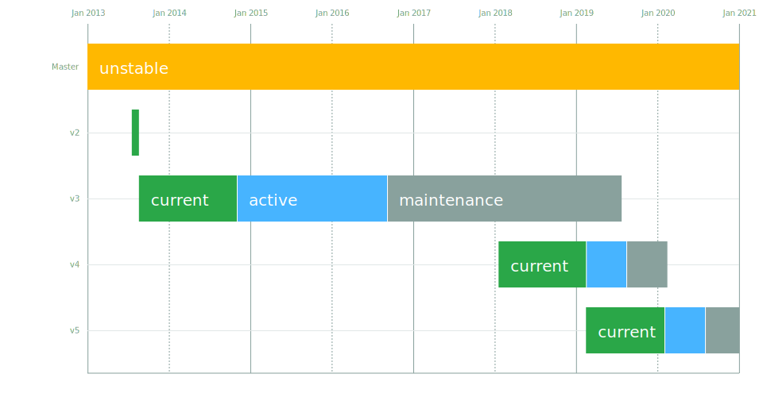

# Bootstrap Release Working Group

## Release schedule

| Release | Status          | Initial Release | Active LTS Start | Maintenance LTS Start | End-of-life |
| :-----: | :-------------: | :-------------: | :--------------: | :-------------------: | :---------: |
| [2.x][] | **End-of-life** | 2013-07-18      | -                | -                     | 2013-08-19  |
| [3.x][] | **End-of-life** | 2013-08-19      | 2014-11-01       | 2016-09-05            | 2019-07-24  |
| [4.x][] | **Active LTS**  | 2018-01-18      | 2019-11-26       | 2020-05-26            | 2020-11-26  |
| 5.x     | **TBD**         | TBD             | TBD              | TBD                   | TBD         |

**Warning:** Dates may vary widely. We are actively working on strengthening timeline assurances.

[2.x]: https://getbootstrap.com/2.3.2/getting-started.html#download-bootstrap
[3.x]: https://getbootstrap.com/docs/3.4/getting-started/#download
[4.x]: https://getbootstrap.com/docs/4.5/getting-started/download/

## Release plan

New releases of Bootstrap are made from the `main` branch to the _Active_ major version. At times to be determined by the release working group, major versions will be frozen and transitioned to _Long Term Support_ (LTS). A long term support branch will be forked from `main`, making way for semver-major changes to be made on `main` and a new _Active_ major version to be prepared.

A version in _Long Term Support_ should not have new features landed without a compelling reason. It may continue to receive:

* Bug fixes
* Security updates
* Documentation updates

After a determined period of time, versions in Long Term Support will be deep-frozen and transition to _Maintenance_.

Versions in _Maintenance_ should not have any changes landed, except for:

* **Critical** bug fixes
* **Critical** security updates
* **Important** documentation updates

Unless a change is urgent, _Maintenance_ releases are likely to be made with minimal frequency.

## Upcoming release schedule

A rough schedule of releases has been included here for planning purposes.

- **Bootstrap 4:**
  - v4.5.3 in September 2020
  - v4.6.0 in October 2020
- **Bootstrap 5:**
  - v5.0.0-alpha2 in September 2020
  - v5.0.0-alpha3 in October 2020
  - v5.0.0-beta1 in October 2020
  - v5.0.0-beta2 in November 2020
  - v5.0.0 in December 2020

## LTS team members

### Releasers

* [@mdo](https://github.com/mdo) – Mark Otto
* [@xhmikosr](https://github.com/xhmikosr)

### Security

* [@bardiharborow](https://github.com/bardiharborow) – Bardi Harborow
* [@Johann-S](https://github.com/Johann-S) – Johann Servoire
* [@xhmikosr](https://github.com/xhmikosr)
